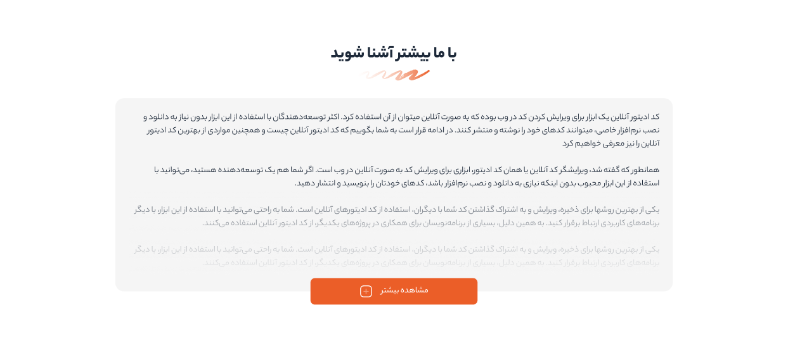
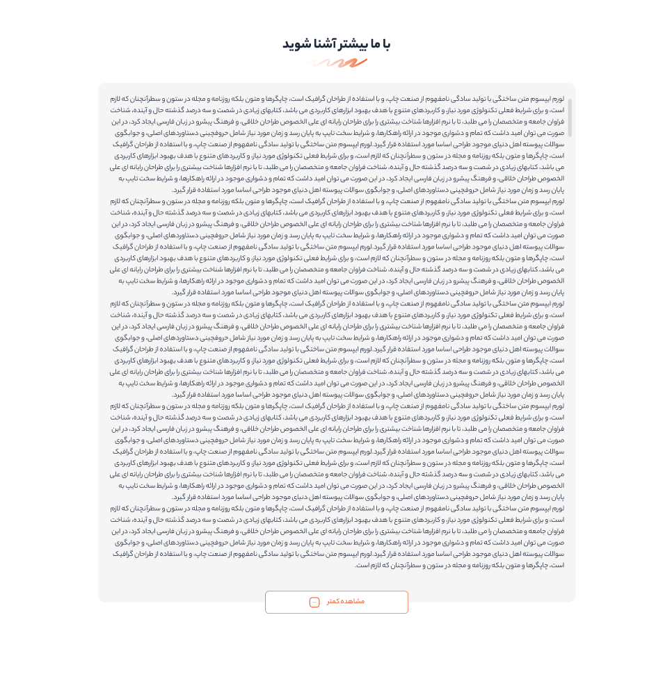

# 🔽 Load More & Custom Scroll

A simple and elegant "Load More / Show Less" feature with custom scrollbar styling — built for right-to-left (RTL) Persian content.

 

### 🖥️ **View**

  
  

 

## 🛠️ Technologies Used

- HTML5 + CSS3
- JavaScript 
- Custom Persian font (Yekan Bakh)
- Fully RTL and Farsi-friendly

 

## 📬 Contact Me

  
  

 

## ⭐ Support

If you liked this project, please consider giving it a **star** ⭐ — it really helps and means a lot!  
Thanks for visiting this repo! Looking forward to your feedback and contributions.